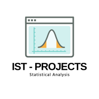
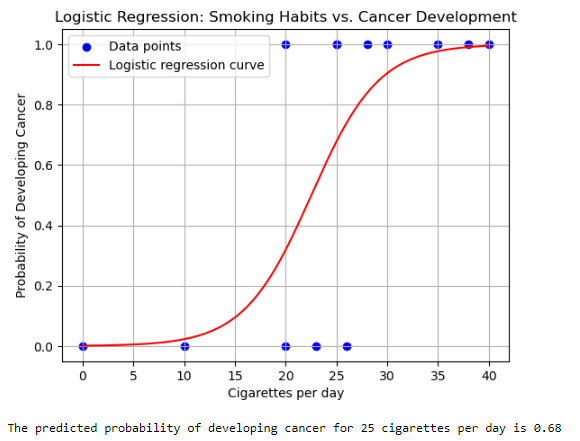

#  Logistic Regression : Smoking Habit Vs Cancer Development
> **Brief Description:** Establishing relationship between the number of cigarettes smoked per day and the likelihood of developing cancer.
> 

---

## Table of Contents

- [Description](#description)
- [Video Explanation](#video)
- [Technologies Used](#technologies-used)
- [Dataset](#dataset)
- [Program Codes ](#program-codes)
- [Screenshots](#screenshots-and-explanations)
- [Contribution](#contributipn)
- [Contact Details](#contact-details)

---

## Description

Establishing a clear releationshib between number of cigerettes smoked and possibility of developing lung cancer. In this case we have used logistic regression technique to predict if a person smokes x number of cigerates, what is the probability of developing cancer in future.

## Video

 

## Technologies-used

Python programming language, pandas and matplotlib package.

## Dataset

The data set is synthetically generated and used for demonstrating the concept only. The program can be easily modified to show results with real readings taken from the patients.

## Program-codes

The programs are written on jupiter notebook, You may run the program on Google colab by clicking on the colab badge below.

## Screenshots and explanations

### Interpretation of the Plot:

#### Title:
"Logistic Regression: Smoking Habits vs. Cancer Development"

#### Axes:
- **X-axis**: Cigarettes per day
- **Y-axis**: Probability of Developing Cancer

#### Data Points:
- Blue dots represent the original data points. These indicate the observed relationship between the number of cigarettes smoked per day and whether cancer was developed (1 for yes, 0 for no).

#### Logistic Regression Curve:
- The red curve represents the logistic regression model. It shows the predicted probability of developing cancer based on the number of cigarettes smoked per day.

#### Interpretation:
1. **Data Points**:
   - For lower numbers of cigarettes per day (0-10), the data points are mostly at 0, indicating a low probability of developing cancer.
   - For higher numbers of cigarettes per day (25-40), the data points are mostly at 1, indicating a high probability of developing cancer.

2. **Logistic Regression Curve**:
   - The curve starts near 0 for 0-10 cigarettes per day, indicating a low probability of developing cancer for light smokers or non-smokers.
   - The curve rises steeply between 15 and 25 cigarettes per day, indicating a rapid increase in the probability of developing cancer as smoking increases.
   - The curve approaches 1 for 30-40 cigarettes per day, indicating a high probability of developing cancer for heavy smokers.

3. **Prediction Example**:
   - The predicted probability of developing cancer for someone who smokes 25 cigarettes per day is 0.68 (68%). This is shown in the plot where the red curve passes through approximately 0.68 on the Y-axis at 25 on the X-axis.

### Conclusion:
The plot visually confirms that there is a strong positive relationship between the number of cigarettes smoked per day and the likelihood of developing cancer. As the number of cigarettes smoked increases, the probability of developing cancer increases significantly, particularly beyond 15-20 cigarettes per day. This relationship is well-captured by the logistic regression curve, which smoothly transitions from low to high probability as smoking habits increase.

## Contribution

The programs are written by Santanu Karmakar

## Contact-details

If you wish to contact me, please leave a message (Preferably WhatsApp) on this number: 6291 894 897.
Please also mention why you are contacting me. Include your name and necessary details.
Thank you for taking an interest.
